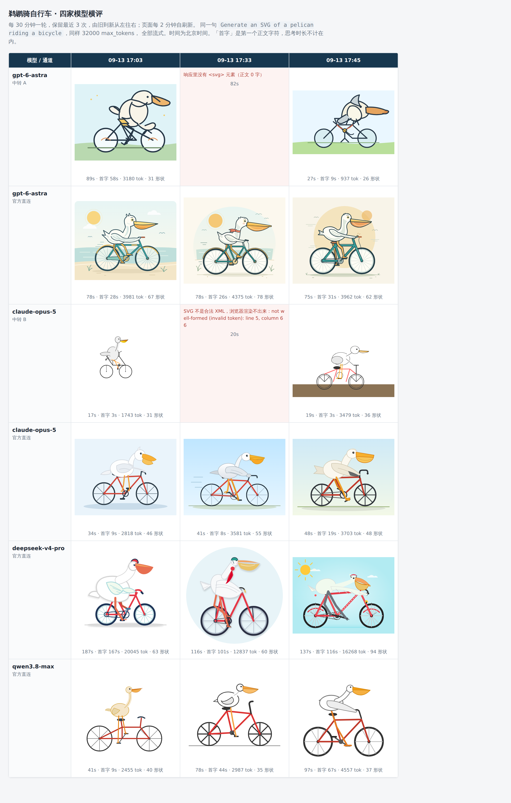

# 鹈鹕横评（Pelican Bench）

> 技能指令见 [SKILL.md](SKILL.md)。这里是给人看的说明。

让若干条「模型 × 通道」画同一张**鹈鹕骑自行车**的 SVG 并排放，同时拿一段逐字不变的短文本
量出每条通道的 **input token 注入**、**思考 token 抑制**和**响应元数据指纹**。



## 它解决什么问题

用 API 中转 / 网关 / 转售商时，你拿到的未必是宣称的东西。常见的手脚有四种：换成更便宜的
模型、偷偷量化、往每个请求里塞隐藏 system prompt、把推理思考关掉。前两种可以靠行为指纹类
工具识别；**后两种会被它们误判**——那类工具自己的文档就承认，只换 system prompt 造成的
分布漂移跟换模型是一个量级，分不清是哪种。

本技能走另一条路：**不猜，只读服务端自己报回来的数字**。

| 看什么 | 说明什么 |
| --- | --- |
| 同款模型跨通道的 `prompt_tokens` 差 | 多出来的就是被塞进去的隐藏上下文，是个确定的 token 数 |
| 同一思考档位下的 `reasoning_tokens` | 推理有没有被抑制 |
| `usage` 里的非标准字段 | 中转层的实现指纹 |
| 响应 id 前缀 | 响应有没有被改写或伪造 |

**关键前提：同一个模型至少配两条通道 —— 可信的官方直连当基线，加上待验的中转。**
没有基线，所有数字都只是绝对值。这也是本技能和同类工具最大的不同：那些工具得靠社区维护的
参考指纹，而你手里往往真有直连账号可比。

## 图是干什么的

「生成一张鹈鹕骑自行车的 SVG」是 Simon Willison 2024 年起的一个公开非正式基准：这个场景在
训练数据里几乎不存在，模型只能真的去算几何，不能靠背。

图本身是**感官参照**——同一道题各家画成什么样，一眼可比，也方便截图给人看。但它温度非零、
方差很大，**单看一张图判不了任何事**。真正下结论要看上面那张表里的数字。

## 三十秒上手

```bash
cp scripts/lanes.env.example ~/.config/pelican-bench/lanes.env
chmod 600 ~/.config/pelican-bench/lanes.env   # 里面是密钥
$EDITOR ~/.config/pelican-bench/lanes.env

python3 scripts/pelican_bench.py --open
```

只用 Python 标准库，不装依赖。挂个定时器就是持续监控；脚本自带锁，上一轮没跑完不会叠上来。

## 要外发截图时

```bash
python3 scripts/pelican_bench.py render --anonymize
```

通道名会被抹成「中转 A / 中转 B」，官方直连保留。上面那张截图就是这么出的 ——
**结论可以分享，被测服务商的名字不必**。

## 边界

只判**通道完整性**（请求在路上被改了什么），不判**模型身份**（端点背后到底是哪个模型）。
后者是行为指纹类工具的活，两者互补。

单轮异常可能只是抖动。判「恒定注入」还是「间歇注入」至少要三轮以上，而这恰好是最有价值的
区分：恒定的可以当常量扣掉；忽大忽小说明后面挂着多个池子、路由随机，**同一个 prompt 的行为
不可复现**。
